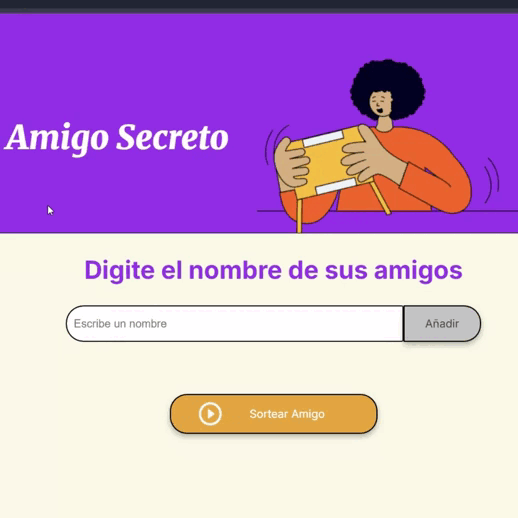
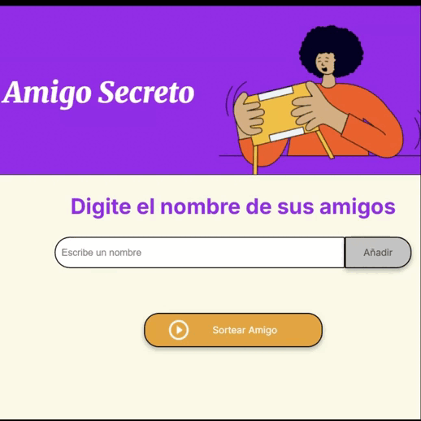

# AluraOne Challenge Amigo Secreto
> Proyecto desarrollado como parte del proceso de selección del Programa ONE de Alura LATAM. Este proyecto busca aplicar los conocimientos adquiridos en los cursos, principalmente en JavaScript y Git/GitHub.
>
> La funcionalidad de esta aplicación de "Amigo Secreto" permite a los usuarios ingresar una lista de nombres. La aplicación sortea a una persona y muestra su nombre en la pantalla.

## Tabla de contenidos
- [Funcionalidades](#funcionalidades)
- [Características](#características)
- [Tecnologías](#tecnologías)
- [Instalación](#instalación)
- [Uso](#uso)
- [Contacto](#contacto)

---

## Funcionalidades
* Agrega nombres de Amigos.
* Los nombres ingresados son mostrados en un recuadro. 
* Selecciona a un amigo entre el listado para ser mostrado como Amigo Secreto.

---

## Características
* Validación de Entrada: Reconoce cuando el usuario ingresa nombres que posea algún caracter diferentes a letras, numeros y `.` `_`. Aunque inmediatamente alerte del fallido ingreso, sí permite el ingreso de combinaciones; pero al menos debe ingresar una letra para ser aceptado. Tambien reconoce cuando el campo está en vacio o solo con espacio devolviendo otra alerta.


  
* Formato automático de nombre: El formato de cada nombre ingresado será automaticamente cambiado a uno que contenga la primera letra en mayúscula y las demas en minúsculas.

* Entrada de datos con el teclado: Los nombres se pueden registrar usando la tecla `Enter` en lugar del mouse. Esto agiliza el proceso y hace que la experiencia sea más rápida y eficiente.
  
* Validación de participantes: El sistema de sorteo verifica automáticamente la cantidad de nombres registrados antes de ejecutar la acción. Si la lista contiene menos de dos participantes, la aplicación muestra una alerta para indicar que se deben añadir más nombres.

* Retroalimentación visual: Cuando un nombre es seleccionado como ganador, el programa lo resalta automáticamente en color rojo dentro de la lista de participantes. Este cambio visual permite una identificación inmediata del nombre que ha sido elegido.



---

## Tecnologías
Este proyecto fue creado con las siguientes tecnologías:
* `HTML5`: Estructura de la aplicación.
* `CSS3`: Estilos y diseño responsivo.
* `JavaScript (Vanilla)`: Lógica de agregar nombres y sorteo.

---

## Instalación

Este proyecto está desarrollado con HTML, CSS y JavaScript Vanilla, por lo que no requiere instalaciones adicionales de librerías ni frameworks.
El archivo clave es app.js, donde se encuentra la lógica de la aplicación.

1. **Clona el repositorio en tu máquina local**
```sh
git clone https://github.com/janampag/AluraOne-Challenge_amigo_secreto.git
cd AluraOne-Challenge_amigo_secreto
```
2. **Verifica la estructura del proyecto**
```
AluraOne-Challenge_amigo_secreto/
├── index.html
├── style.css
├── app.js
└── assets/ (si corresponde)
```
3. **Carga el proyecto en tu navegador**

* Haz doble clic en `index.html`, o
* Usa la extensión `Live Server` en VS Code para abrirlo en http://localhost:5500.

## Uso
🔹 Localmente

Abre `index.html` en tu navegador.

* El script app.js se ejecutará automáticamente y controlará toda la lógica.
* Ingresa los nombres en el campo de texto y presiona Enter o el botón Agregar.
* Cuando tengas al menos dos participantes, haz clic en Sortear Amigo.
* El nombre sorteado aparecerá en pantalla y se resaltará en rojo dentro de la lista.

🔹 En línea

También puedes usar la aplicación desde GitHub Pages sin necesidad de instalar nada:
https://janampag.github.io/AluraOne-Challenge_amigo_secreto/

## Contacto
* **JanampaG** https://github.com/janampag

